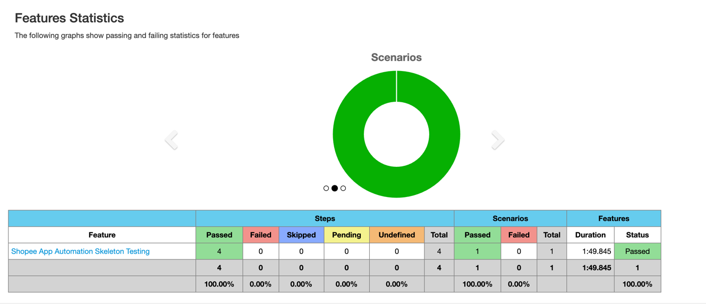

# 🧪 Shopee App Test Automation
**Java + Appium + Cucumber + JUnit

This project contains end-to-end mobile test automation for the **Shopee Android app**, built using **Java**, **Appium**, and **Cucumber BDD**. Tests are executed via **Maven**, and reports are generated using **cucumber-reporting**.

---

## 🚀 Tech Stack

- Java 23
- Maven
- Appium
- Cucumber + Gherkin
- JUnit
- Maven Failsafe Plugin
- cucumber-reporting
- Android Emulator

---

## ⚙️ Setup Instructions

### ✅ Prerequisites

- Java 23+
- Maven 3.8+
- Node.js and Appium
- Android SDK
- Emulator
- Shopee App

### 📥 Install Dependencies

```bash
mvn clean install
```

### 🧬 Writing New Tests
- Add .feature file in features/
- Define step logic in steps/
- Create reusable page functions in pages/
- Annotate test scenario with @tag

### Sample Results
